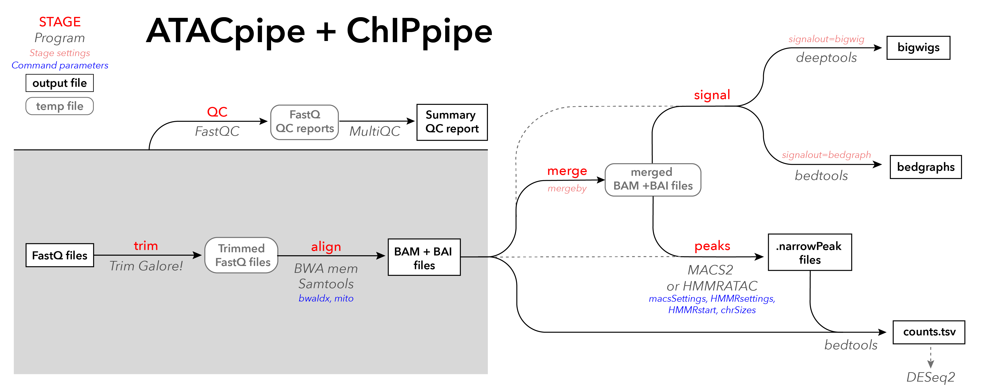

# RNApipe
Katie Metz Reed\
*Last Updated: 09-07-2020*

Phanstiel lab (temporary?) pipeline for paired-end RNAseq data.

This pipeline is incorporated with the lab Sequencing Data sheet. The idea is that you run the pipeline without providing your own sample sheet, but by selecting your samples of interest from the Master sheet using [Input Parameters](#input-parameters). Think of it like filtering the spreadsheet.

You can select [what parts of the pipeline to run](#run-parameters), depending on the desired outputs. The major outputs are:
1. quantification files used for differential analysis in R - does NOT require alignment\
(<code>--stage trim,quant</code>)
2. QC summary html files detailing quality of samples \
(<code>--stage QC</code>)
3. signal tracks for plotting - DOES require alignment\
(<code>--stage trim,align,signal,merge</code>)

Unfortunately, the code is super cumbersome and it's also written in python 2 (!!!). [I might update it](#changes-to-make), so feel free to message me with suggestions, but we will probably just eventually replace RNApipe with a more streamlined and light-weight pipeline (snakemake, or maybe just a bash script or something). But! It's still functional, and it has a lot of heart, and isn't that what matters?

***New!!!*** We now have ATACpipe and ChIPpipe as well, for running paired-end data of other types! Usage will be very similar overall, but see the section on [Variations: ATACpipe and ChIPpipe](#variations-atacpipe-and-chippipe) for more details.

#### TABLE OF CONTENTS
- [Quickstart](#quickstart)
- [Detailed Usage](#detailed-usage)
	- [Input Parameters](#input-parameters)
	- [Output Parameters](#output-parameters)
	- [Run Parameters](#run-parameters)
	- [Command Parameters](#command-parameters)
- [Commands Run](#commands-run)
	- [CORE scripts](#core-scripts)
	- [MERGE scripts](#merge-scripts)
	- [FINAL scripts](#final-scripts)
- [Variations: ATACpipe and ChIPpipe](#variations-atacpipe-and-chippipe)
	- [Input Parameters](#atacchip-input-parameters)
	- [Output Parameters](#atacchip-output-parameters)
	- [Run Parameters](#atacchip-run-parameters)
	- [Command Parameters](#atacchip-command-parameters)
- [Changes to Make](#changes-to-make)

------------------------------

## Quickstart

1. **Make sure your sample info is entered into the "Sequencing Data" spreadsheet on the lab Google Drive**
	- Edit *your copy* of the sheet (if you don't have one, ask Katie or [make your own](https://docs.google.com/spreadsheets/d/13dfdyM4HxgsEoFhiuDqrohGfLulVtxYHqSK1dA29Xvw/edit#gid=2031315238))
	- The [master sheet](https://docs.google.com/spreadsheets/d/14-j6QiyzX4oV378CgQhb6btfaaopbZTRXew1FxN1vag/edit#gid=673528436) should update with your run info automatically once your personal sheet is set up
	- <span style="background-color: #ea9999">Pink columns</span> are required (A-N, V-X). See "Instructions" tab in spreadsheet for more details

2. **Log onto longleaf using your ONYEN**

	- <code>ssh onyen@longleaf.unc.edu</code>

3. **Make sure the most up-to-date sample sheet is on the cluster.**
	- The sample sheet lives on the cluster, here:\
	 <code>/proj/phanstiel_lab/software/RNApipe/config/SequencingData_YYYY-MM-DD_datatype.tsv</code>
	- Check that the date of the sample sheet is past when you entered your info. Note that there will be different sheets for different tabs of the sample sheet, ending in either <code>rna.tsv</code>, <code>atac.tsv</code>, or <code>chip.tsv</code> - make sure you are looking at the right one! The most recently added samples (based on Sequencing Date) will be at the top of the file
	- If you need to update the sheet on the cluster, run the following commands from the cluster to upload it:

       ```bash
       module load launch_pipeline
       launch googleSync rna
       ```
    - Note that if you are running ATACpipe or ChIPpipe, you can use the same command to <code>launch googleSync chip</code> or <code>launch googleSync atac</code>

4. **Navigate to your folder in the lab directory on longleaf**

	- <code>cd /proj/phanstiel_lab/users/ONYEN</code>

5. **Load the launch_pipeline module (if you didn't already to update the sample sheet)**

	- <code>module load launch_pipeline</code>

6. **Run RNApipe, ATACpipe, or ChIPpipe, selecting for the Project you want** \
	Note: See [Detailed Usage: Input Parameters](#input-parameters) for other options to filter the samplesheet with. Other sections also detail how to change the [output file paths](#output-parameters), [what parts of the pipeline](#run-parameters) are run, and [how they are run](#command-parameters). Remember to see [Variations: ATACpipe and ChIPpipe](#variations-atacpipe-and-chippipe) for details specific to those versions of the pipeline.
	- <code>launch RNApipe --p PROJ [options]</code>

7. **Review the run info printed to terminal screen**
	- This will include the samples selected, samples merged together, stages to be run, and full path to output directory, among other info. 
	- If the information looks right, answer <code>hell yeah</code> and monitor your run with <code>squeue -u onyen</code>! It's a good idea to double check that no errors appear while the jobs are submitted.
	- If the information looks wrong, answer <code>nah</code> and adjust your RNApipe.py options.

See below for more detailed usage, or use:\
<code>launch RNApipe --help</code>\
<code>launch ChIPpipe --help</code>\
<code>launch ATACpipe --help</code>\

[Back to Top](#table-of-contents)

-----------------

## Detailed Usage

### Input Parameters 
***Parameters that control which samples are run in the pipeline*** \
Many RNApipe.py options are used in combination to determine which files from the Sequencing Data sheet you would like to run. They correspond to the first several columns (C through M) of the data sheet. These options include:
- <code>-p</code> (<code>--p</code>, <code>--proj</code>, <code>--PROJ</code>, <code>--project</code>) \
**REQUIRED** (unless manual config file supplied)
- <code>--cell</code> (<code>--CELL</code>)
- <code>--geno</code> (<code>--g</code>, <code>--GENO</code>, <code>--genotype</code>)
- <code>--cond</code> (<code>--COND</code>, <code>--condition</code>)
- <code>--time</code> (<code>--TIME</code>)
- <code>--br</code> (<code>--bior</code>, <code>--BIOR</code>, <code>--biorep</code>, <code>--bio</code>)
- <code>--tr</code> (<code>--techr</code>, <code>--TECR</code>, <code>--techrep</code>, <code>--tech</code>)
- <code>--sr</code> (<code>--seqr</code>, <code>--SEQR</code>, <code>--seqrep</code>, <code>--seq</code>)
- <code>--tag</code> (<code>--TAG</code>) \
**DEFAULT:** S (ignores MiniSeq QC runs)
- <code>-u</code> (<code>--user</code>, <code>--USER</code>, <code>--onyen</code>, <code>--ONYEN</code>)

For all options not selected, with the exception of TAG, it will default to picking all available options for the project listed. The <code>--project</code> option is required.

#### Manual samplesheet input
There is also a <code>--manual</code> (also <code>--MAN</code>, <code>--man</code>, <code>--MANUAL</code>) option that can override the Sequencing Data sheet. You can use this command to point to a different config file, and the program will run on *all* of the samples listed in that file, rather than subsetting the Master sheet. **Unforuntately,** for most reliable results (until Katie gets off her butt and rewrites this entire thing), it is best to format manual sheets after at least columns A-K and V-X of the Master Sheet. Additional columns can be added for metadata. 

#### Examples
To run all biological replicates for the project LIMA, you would enter: \
<code>python /proj/phanstiel_lab/software/RNApipe/RNApipe.py --proj LIMA </code>

To run biological reps 2 and 3 (but not 1) of the LIMA project, you could enter: \
<code>python /proj/phanstiel_lab/software/RNApipe/RNApipe.py --proj LIMA --br 2,3</code>

Alternatively, to run these samples with a manual sheet, you could make a sheet that looks as follows and run this command: \
<code>python /proj/phanstiel_lab/software/RNApipe/RNApipe.py --manual mySampleSheet.tsv</code>

| Unique_ID | Name | Project | Cell_Type | Genotype | Condition | Time | Bio_Rep | Tech_Rep | Seq_Rep | Tag | Read1	| Read2	| Sequencing_Directory |
|-----------|------|---------|-----------|----------|-----------|------|---------|----------|---------|-----|-------|-------|----------------------|
|KR0A9DF4	| LIMA_RNA_THP1_WT_LPIF_0030_S_3.1.1	| LIMA	| THP1	| WT | LPIF	| 0030	| 3	| 1	| 1	| S | LIMA_RNA_THP-1_0030_3-1-1_S2_R1_001.fastq.gz	| LIMA_RNA_THP-1_0030_3-1-1_S2_R2_001.fastq.gz	| /proj/phanstiel_lab/Data/raw/LIMA/rna/NextSeq_180504_LIMA_3.1.1/fastq/ |
|KR751205	| LIMA_RNA_THP1_WT_LPIF_0060_S_3.1.1	| LIMA	| THP1	| WT | LPIF	| 0060	| 3	| 1	| 1	| S | LIMA_RNA_THP-1_0060_3-1-1_S3_R1_001.fastq.gz	| LIMA_RNA_THP-1_0060_3-1-1_S3_R2_001.fastq.gz	| /proj/phanstiel_lab/Data/raw/LIMA/rna/NextSeq_180504_LIMA_3.1.1/fastq/ |
|KR02C443	| LIMA_RNA_THP1_WT_LPIF_0090_S_3.1.1	| LIMA	| THP1	| WT | LPIF	| 0090	| 3	| 1	| 1	| S | LIMA_RNA_THP-1_0090_3-1-1_S4_R1_001.fastq.gz	| LIMA_RNA_THP-1_0090_3-1-1_S4_R2_001.fastq.gz	| /proj/phanstiel_lab/Data/raw/LIMA/rna/NextSeq_180504_LIMA_3.1.1/fastq/ |
|KR08B759	| LIMA_RNA_THP1_WT_LPIF_0120_S_3.1.1	| LIMA	| THP1	| WT | LPIF	| 0120	| 3	| 1	| 1	| S | LIMA_RNA_THP-1_0120_3-1-1_S5_R1_001.fastq.gz	| LIMA_RNA_THP-1_0120_3-1-1_S5_R2_001.fastq.gz	| /proj/phanstiel_lab/Data/raw/LIMA/rna/NextSeq_180504_LIMA_3.1.1/fastq/ |
|KR365BAB	| LIMA_RNA_THP1_WT_LPIF_0240_S_3.1.1	| LIMA	| THP1	| WT | LPIF	| 0240	| 3	| 1	| 1	| S | LIMA_RNA_THP-1_0240_3-1-1_S6_R1_001.fastq.gz	| LIMA_RNA_THP-1_0240_3-1-1_S6_R2_001.fastq.gz	| /proj/phanstiel_lab/Data/raw/LIMA/rna/NextSeq_180504_LIMA_3.1.1/fastq/ |
|KR8A7D54	| LIMA_RNA_THP1_WT_LPIF_0360_S_3.1.1	| LIMA	| THP1	| WT | LPIF	| 0360	| 3	| 1	| 1	| S | LIMA_RNA_THP-1_0360_3-1-1_S7_R1_001.fastq.gz	| LIMA_RNA_THP-1_0360_3-1-1_S7_R2_001.fastq.gz	| /proj/phanstiel_lab/Data/raw/LIMA/rna/NextSeq_180504_LIMA_3.1.1/fastq/ |
|KR0CE283	| LIMA_RNA_THP1_WT_LPIF_1440_S_3.1.1	| LIMA	| THP1	| WT | LPIF	| 1440	| 3	| 1	| 1	| S | LIMA_RNA_THP-1_1440_3-1-1_S8_R1_001.fastq.gz	| LIMA_RNA_THP-1_1440_3-1-1_S8_R2_001.fastq.gz	| /proj/phanstiel_lab/Data/raw/LIMA/rna/NextSeq_180504_LIMA_3.1.1/fastq/ |
|KR031F3D	| LIMA_RNA_THP1_WT_LPIF_0000_S_2.1.1	| LIMA	| THP1	| WT | LPIF	| 0000	| 2	| 1	| 1	| S | LIMA_RNA_THP-1_0000_2-1-1_S1_R1_001.fastq.gz	| LIMA_RNA_THP-1_0000_2-1-1_S1_R2_001.fastq.gz	| /proj/phanstiel_lab/Data/raw/LIMA/rna/NextSeq_180502_LIMA_2.1.1/fastq/ |
|KR13130A	| LIMA_RNA_THP1_WT_LPIF_0030_S_2.1.1	| LIMA	| THP1	| WT | LPIF	| 0030	| 2	| 1	| 1	| S | LIMA_RNA_THP-1_0030_2-1-1_S2_R1_001.fastq.gz	| LIMA_RNA_THP-1_0030_2-1-1_S2_R2_001.fastq.gz	| /proj/phanstiel_lab/Data/raw/LIMA/rna/NextSeq_180502_LIMA_2.1.1/fastq/ |
|KR772B9D	| LIMA_RNA_THP1_WT_LPIF_0060_S_2.1.1	| LIMA	| THP1	| WT | LPIF	| 0060	| 2	| 1	| 1	| S | LIMA_RNA_THP-1_0060_2-1-1_S3_R1_001.fastq.gz	| LIMA_RNA_THP-1_0060_2-1-1_S3_R2_001.fastq.gz	| /proj/phanstiel_lab/Data/raw/LIMA/rna/NextSeq_180502_LIMA_2.1.1/fastq/ |
|KR62E3AC	| LIMA_RNA_THP1_WT_LPIF_0090_S_2.1.1	| LIMA	| THP1	| WT | LPIF	| 0090	| 2	| 1	| 1	| S | LIMA_RNA_THP-1_0090_2-1-1_S4_R1_001.fastq.gz	| LIMA_RNA_THP-1_0090_2-1-1_S4_R2_001.fastq.gz	| /proj/phanstiel_lab/Data/raw/LIMA/rna/NextSeq_180502_LIMA_2.1.1/fastq/ |
|KR2BA90C	| LIMA_RNA_THP1_WT_LPIF_0120_S_2.1.1	| LIMA	| THP1	| WT | LPIF	| 0120	| 2	| 1	| 1	| S | LIMA_RNA_THP-1_0120_2-1-1_S5_R1_001.fastq.gz	| LIMA_RNA_THP-1_0120_2-1-1_S5_R2_001.fastq.gz	| /proj/phanstiel_lab/Data/raw/LIMA/rna/NextSeq_180502_LIMA_2.1.1/fastq/ |
|KR79BBD3	| LIMA_RNA_THP1_WT_LPIF_0240_S_2.1.1	| LIMA	| THP1	| WT | LPIF	| 0240	| 2	| 1	| 1	| S | LIMA_RNA_THP-1_0240_2-1-1_S6_R1_001.fastq.gz	| LIMA_RNA_THP-1_0240_2-1-1_S6_R2_001.fastq.gz	| /proj/phanstiel_lab/Data/raw/LIMA/rna/NextSeq_180502_LIMA_2.1.1/fastq/ |
|KR859E81	| LIMA_RNA_THP1_WT_LPIF_0360_S_2.1.1	| LIMA	| THP1	| WT | LPIF	| 0360	| 2	| 1	| 1	| S | LIMA_RNA_THP-1_0360_2-1-1_S7_R1_001.fastq.gz	| LIMA_RNA_THP-1_0360_2-1-1_S7_R2_001.fastq.gz	| /proj/phanstiel_lab/Data/raw/LIMA/rna/NextSeq_180502_LIMA_2.1.1/fastq/ |
|KR3136D3	| LIMA_RNA_THP1_WT_LPIF_1440_S_2.1.1	| LIMA	| THP1	| WT | LPIF	| 1440	| 2	| 1	| 1	| S | LIMA_RNA_THP-1_1440_2-1-1_S8_R1_001.fastq.gz	| LIMA_RNA_THP-1_1440_2-1-1_S8_R2_001.fastq.gz	| /proj/phanstiel_lab/Data/raw/LIMA/rna/NextSeq_180502_LIMA_2.1.1/fastq/ |

[Back to Top](#table-of-contents)

-----------------

### Output Parameters
***Parameters that control the name and location of the output files*** \
By default, the pipeline will create an output directory relative to where the program is run. Typically, you will move to the user directory at <code>/proj/phanstiel_lab/users/ONYEN</code>, and it will create the following output directory structure (based on the parts of the pipeline run; see [Detailed Usage: Run Parameters](#run-parameters)):
```bash
. {HOME} # PWD, or path set by --home
└── {PROJ} # Based off 'Project' column in sample sheet
    └── rna
        └── {NAME} # Auto-generated OR set with --name, appended with --suffix
             ├── config    # Subset samplesheet used; merged sequence info sheet
             ├── debug     # Standard out/error log files
             ├── fastq     # Links to fastq files used
             ├── scripts   # SLURM scripts written and used
             ├── (aligned) # BAM + BAI files
             ├── (QC)      # MultiQC summary HTML report
             ├── (quant)   # quant.sf files, tximport .RDS for use in DESeq2
             ├── (signal)  # Signal tracks (bedgraphs and/or bigwigs)
             └── (splice)  # LSV + other MAJIQ files
```

#### Defaults
The **{HOME}** directory is, by default, your present working directory. It is recommended that you move to <code>/proj/phanstiel\_lab/users/onyen</code> prior to running for best results. Edit with <code>--home</code> (see below).

The **{PROJ}** name is determined by the "Project" column of the samples you selected from the Master sheet, or provided in the manual sheet. This can't be changed at this time.

The **{NAME}** of the final output directory is created automatically based on the "Project", "Cell_Type", "Genotype", "Condition", "Time", and "Tag" columns selected or provided. With the exception fo "Tag", it will only use columns that are shared between *all* slected samples. Edit with <code>--name</code> and <code>--suffix</code> (see below).

For example, if I ran *all* LIMA samples, including MiniSeq Data (using <code>--tag Q,S</code>), the name would be <code>LIMA_THP1_WT_QS</code>. 

Within <code>/proc</code>, directories will be created according to your run. The directories <code>config</code>, <code>debug</code>, <code>fastq</code>, and <code>scripts</code> will always be generated, while the others will depend on which parts of the pipeline you are running (see [Detailed Usage: Run Parameters](#run-parameters)).


#### Options
- <code>--name</code> (<code>-n</code>, <code>--n</code>): Replace the auto-generated **{NAME}** with any name of your choosing 
- <code>--suffix</code> (<code>--suff</code>, <code>--SUFF</code>, <code>--SUFFIX</code>): Add a suffix to the auto-generated **{NAME}**\
**NOTE:** if you provide a manual sheet, it will by default append the suffix <code>MANUAL</code> 
- <code>--home</code> (<code>--o</code>, <code>--dir</code>, <code>--HOME</code>, <code>--OUT</code>, <code>--DIR</code>): Change the **{HOME}** directory to somewhere other than your PWD (see top of diagram)

[Back to Top](#table-of-contents)

-----------------

### Run Parameters 
***Parameters that control what parts of the pipeline to run*** \
By default, the pipeline will trim low-quality reads, quantify transcripts for use in DESeq2, and align transcripts to create signal tracks and splicing info (see map below). There are several temporary files created in this process that are deleted by default during the pipeline (grey boxes below). If files already exist from previous runs, the default behavior is to overwrite them. These default settings can be changed by many run parameters, described below. 


- <code>--stage</code> (<code>--STAGE</code>, <code>--S</code>): Set what stages you want the pipeline to run, separated by commas **without spaces** \
**DEFAULT:** <code>QC,trim,align,quant,signal</code>\
Options include:
	- <code>QC</code>: Create individual and summary reports of QC metrics for sequencing and alignment, using FastQC + MultiQC
	- <code>trim</code>: Remove adapters and low-quality reads from fastq files, using Trim Galore!
	- <code>align</code>: Align reads to transcriptome (required for signal tracks or splicing info), using HISAT2 and Samtools
	- <code>quant</code>: Quantify reads and summarize at a gene level for use in DESeq2, using Salmon and txImport
	- <code>splice</code>: Identify splicing variants, using MAJIQ
	- <code>signal</code>: Create bedgraph or bigwig signal tracks
	- <code>merge</code>: Combine aligned files to make merged signal tracks
- <code>--merge</code> (<code>--mergeby</code>, <code>--MERGE</code>): Select how you would like to merge samples \
**DEFAULT:** If you include <code>--stage merge</code>, it will combine any samples that have the same info in all columns except for Bio_Rep, Tech_Rep, and Seq_Rep (i.e. <code>LIMA_THP1_WT_0000_1.1.1_Q</code> would merge with <code>LIMA_THP1_WT_0000_2.3.5_Q</code> but not <code>LIMA_THP1_WT_0030_1.1.1_Q</code>).
- <code>--temp</code> (<code>--TEMP</code>, <code>--keep</code>, <code>--KEEP</code>): True/False for whether to keep temporary files \
**DEFAULT:** False
- <code>--signalout</code> (<code>--sigout</code>, <code>--SIGNALOUT</code>, <code>--SIGOUT</code>): Select signal output file type. Options are "bigwig" and "bedgraph"\
**DEFAULT:** bigwig
- <code>--rerun</code> (<code>--RERUN</code>): True/False for whether to overwrite existing files that might exist from previous runs \
**DEFAULT:** True

[Back to Top](#table-of-contents)

-----------------

### Command Parameters 
***Parameters that are fed directly into the program commands*** \
The pipeline will run many programs. Some of the options for these programs are hard-coded, while others can be changed through the command parameters of RNApipe.py. These options include:

#### *txImport* (for --stage quant)
- <code>--ann</code> (<code>--ANN</code>, <code>--annotation</code>, <code>--gtf</code>, <code>--GTF</code>): Path to transcriptome annotation file\
**DEFAULT:** hg19 \
<code>/proj/phanstiel_lab/SHARE/genomes/GENCODE.v19/gencode.v19.annotation.gtf_withproteinids</code>

#### *Salmon* (for --stage quant)
- <code>--trns</code> (<code>--TRNS</code>, <code>--transcript</code>): Path to Salmon transcript index \
**DEFAULT:** hg19 \
<code>/proj/phanstiel_lab/SHARE/geonmes/GENCODE.v19/salmon_index</code>

#### *HISAT2* (for --stage align)
- <code>--hisatidx</code> (<code>--HSIDX</code>, <code>--hisat2idx</code>, <code>--hisat2index</code>): Path to HISAT2 index \
**DEFAULT:** hg19 \
<code>/proj/seq/data/HG19_UCSC/Sequence/HISAT2Index/genome</code>

#### *MAJIQ* (for --stage splice)
- <code>--majConfig</code> (<code>--mfqConfig</code>, <code>--mjqcon</code>, <code>--majcon</code>): Path to custom MAJIQ configuration file \
**DEFAULT:** automatically generated config based on sample config, other options \
<code>{HOME}/project/{PROJ}/rna/{NAME}/proc/config/MAJIQconfig_NAME_YYMMDD_HHMMSS.txt </code>
- <code>--length</code> (<code>--readlength</code>, <code>--readlen</code>, <code>--len</code>): Read length, for MAJIQ config file \
**DEFAULT:** 150
- <code>--genome</code>: Name of genome used, for MAJIQ config file \
**DEFAULT:** hg19
- <code>--strand</code> (<code>--strandness</code>): Strandness, chosen from ‘forward’, ‘reverse’ and ‘None’, for MAJIQ config file \
**DEFAULT:** forward
- <code>--mjqann</code> (<code>--MJQANN</code>, <code>--majiqannotation</code>, <code>-gff3</code>, <code>--GFF3</code>): GFF3 transcriptome annotation \
**DEFAULT:** hg19 \
<code>/proj/phanstiel_lab/SHARE/genomes/GENCODE.v19/gencode.v19.annotation.gtf_withproteinids</code>

[Back to Top](#table-of-contents)

-----------------

## Commands Run
***Overview of commands run by RNApipe.py SLURM scripts***\
This section will roughly review the commands (including built-in and user-provided settings) run by RNApipe.py, given each stage selected. Paths will be abbreviated with (...) replacing <code>{HOME}/{RPOJ}/rna/{NAME}/</code>. “Name” represents the name of the sample (from the “Name” column of the sample sheet), while "{NAME}" represents the project name generated automatically or provided by the <code>--name</code> command (see Output Parameters). "MergeName" represnts the combined name from merging samples when <code>--stage merge</code> is set, based on the <code>--mergeby</code> settings.

#### CORE SCRIPTS
These commands are written and run for every sample (line) in the samplesheet provided.

##### QC stage
1. <code>fastqc -o .../QC .../fastq/Name\_R1.fastq.gz .../fastq/Name\_R2.fastq.gz</code>

##### trim stage
2.  <code>trim\_galore -o .../fastq --paired .../fastq/Name\_R1.fastq.gz .../fastq/Name\_R2.fastq.gz</code>
3.  <code>mv .../fastq/Name\_R1\_val_1.\* .../fastq/Name\_1\_trimmed.fq.gz</code>
4.  <code>mv .../fastq/Name\_R1\*\_trimming\_report.txt ../fastq/Name\_1.fastq\_trimming\_report.txt</code>
5.  <code>mv .../fastq/Name\_R2\_val\_2.\* .../fastq/Name\_2\_trimmed.fq.gz</code>
6.  <code>mv .../fastq/Name\_R2\*\_trimming\_report.txt ../fastq/Name\_2.fastq\_trimming\_report.txt</code>

##### quant stage
7. <code>salmon quant --writeUnmappedNames --threads 1 -i {TRNS} -l A -1 .../fastq/Name\_1\_trimmed.fq.gz -2 .../fastqName\_2\_trimmed.fq.gz -o .../quant/Name</code>

##### align stage
8. <code>hisat2 -q -x HSIDX -1 .../fastq/Name\_1\_trimmed.fq.gz -2 .../fastq/Name\_2\_trimmed.fq.gz \| samtools view -u \| samtools sort -o .../align/Name\_sorted.bam</code>
9. <code>samtools flagstat .../align/Name\_sorted.bam > .../align/Name\_stats.txt</code>
10. <code>samtools index .../align/Name\_sorted.bam</code>

##### temp/keep set to False
11. <code>rm .../fastq/Name\_1\_trimmed.fq.gz</code>
12. <code>rm .../fastq/Name\_2\_trimmed.fq.gz</code>

##### signal stage, signalout set to bedgraph
13. <code>bedtools genomecov -bga -ibam .../align/Name\_sorted.bam > .../signal/Name.bedgraph</code>

##### signal stage, signalout set to bigwig
14. <code>bamCoverage -b .../align/Name\_sorted.bam -o .../signal/Name.bw</code>
15. <code>bamCoverage --filterRNAstrand forward -b .../align/Name\_sorted.bam -o .../signal/Name_fwd.bw</code>
16. <code>bamCoverage --filterRNAstrand reverse -b .../align/Name\_sorted.bam -o .../signal/Name_rev.bw</code>

#### MERGE SCRIPTS
These commands are run for every merged sample in <code>.../config/mergeList</code>, as deteremined by <code>--stage merge</code> and <code>--mergeby</code>.

##### merge stage
1. <code>samtools merge .../align/MERGE\_MergeName.bam .../align/Name1\_sorted.bam .../align/Name2\_sorted.bam</code>
2. <code>samtools index .../align/MERGE\_MergeName.bam</code>

##### signal stage, signalout set to bedgraph
3. <code>bedtools genomecov -bga -ibam .../align/MERGE\_MergeName.bam > .../signal/MERGE\_MergeName.bedgraph</code>

##### signal stage, signalout set to bigwig
4. <code>bamCoverage -b .../align/MERGE\_MergeName.bam -o .../signal/MERGE\_MergeName.bw</code>
5. <code>bamCoverage --filterRNAstrand forward -b .../align/MERGE\_MergeName.bam -o .../signal/MERGE\_MergeName_fwd.bw</code>
6. <code>bamCoverage --filterRNAstrand reverse -b .../align/MERGE\_MergeName.bam -o .../signal/MERGE\_MergeName_rev.bw</code>

##### temp/keep set to False
7. <code>rm .../align/MERGE\_MergeName.bam</code>
8. <code>rm .../align/MERGE\_MergeName.bam.bai</code>

#### FINAL SCRIPTS
Run only one time for the entire samplesheet

##### QC stage
1. <code>multiqc -f .../proc/* -o .../QC</code>
2. <code>mv .../QC/multiqc\_report.html .../QC/NAME\_multiqc\_report.html</code>

##### temp/keep set to False
3. <code>rm .../QC/\*fastqc.zip</code>
4. <code>rm .../QC/\*fastqc.html</code>
5. <code>rm .../fastq/\*fastq\_trimming\_report.txt</code>

##### quant stage
6. <code>Rscript /proj/phanstiel\_lab/software/RNApipe/txImporter.R .../config/config\_NAME\_YYMMDD\_HHMMSS.tsv {ANNT} .../quant {NAME}</code>

##### splice stage
7. <code>majiq build {MJQANN} -c {MJQCON} -j 8 -o .../splice</code>

[Back to Top](#table-of-contents)

-----------------

## Variations: ATACpipe and ChIPpipe

There are also similar pipelines for processing paired-end ChIP-seq (without input control) and ATAC-seq/FAIRE-seq data. For the most part these pipelines function exactly the same as RNApipe, as they were built from the same script. As such, only the differences between RNApipe and these pipelines are detailed here.

Overall, ATACpipe and ChIPpipe are incredibly similar - the major differences lay in the filtering of reads and calling of peaks for ATAC. For both pipelines, the major outputs are:
1. a TSV matrix listing the positions of all peaks (merged among all samples), and a list of all counts at each position, for downstream differential analysis in R\
(<code>--stage trim,align,peaks</code>)
2. QC summary html files detailing quality of samples\
(<code>--stage QC</code>)
3. signal tracks for plotting\
(<code>--stage trim,align,signal,merge</code>)


### ATAC/ChIP Input Parameters 

The input process is the same as RNApipe, with either a filtering of the Master Sequencing Sheet, or providing your own sheet with <code>--MANUAL</code>, that is formatted in the same way. There are two input parameters unique to these pipelines:
- <code>--assay</code> (<code>--ASSAY</code>, <code>--a</code>)\
ATACpipe only. Used to select the assay name (as ATACpipe can use either ATAC or FAIRE-seq data)
- <code>--target</code> (<code>--TARGET</code>, <code>--targ</code>, <code>--TARG</code>, <code>--t</code>)\
ChIPpipe only. Used to select the IP target (i.e. H3K27ac). **REQUIRED.** 

### ATAC/ChIP Output Parameters 

Output structure and parameters are [the same as for RNApipe](#output-parameters). The only difference is that the directory containing the **{NAME}** directory will be called <code>atac</code> or <code>chip</code>, accordingly.

### ATAC/ChIP Run Parameters 

This is where you begin to see major divergence between RNApipe and ATACpipe + ChIPpipe. Both variant pipelines have an identical pipeline flow, diagrammed below.



As such, the <code>--stage</code> parameters to chose from are:
- <code>QC</code>: Create individual and summary reports of QC metrics for sequencing and alignment, using FastQC + MultiQC
- <code>trim</code>: Remove adapters and low-quality reads from fastq files, using Trim Galore!
- <code>align</code>: Align reads to transcriptome (required for signal tracks or splicing info), using HISAT2 and Samtools. Reads are also filtered in different ways.
- <code>peaks</code>: Call peaks using MACS2 or HMMRATAC (ATACpipe only), and create a count matrix used for downstream differential analysis in DESeq2
- <code>signal</code>: Create bedgraph or bigwig signal tracks
- <code>merge</code>: Combine aligned files to make merged signal tracks

The other run parameters (such as <code>--merge</code>, <code>--temp</code>, <code>--signalout</code>, and <code>--rerun</code>) behave the same as in RNApipe.

### ATAC/ChIP Command Parameters 

As most RNApipe command parameters pertained to RNA-specific commands, there are far fewer command parameters for ATACpipe and ChIPpipe. These include:

#### *MITO* (for --stage align in ATACpipe)
- <code>--mito</code> (<code>--chrM</code>, <code>--mitochrom</code>, <code>--chromM</code>, <code>--MITO</code>): Name of mitochondrial chromosome for filtering; should match BWA index file \
**DEFAULT:** chrM

#### *BWA* (for --stage align)
- <code>--bwaidx</code> (<code>--BWAIDX</code>, <code>--BWAidx</code>, <code>--bwaindex</code>): Path to Salmon transcript index \
**DEFAULT:** hg19 \
<code>/proj/seq/data/HG19_UCSC/Sequence/BWAIndex/genome.fa</code>

#### *MACS2* (for --stage peaks)
- <code>--macs2</code> (<code>--MACS2</code>, <code>--macs2settings</code>, <code>--MACS2settings</code>): Settings passed to <code>macs2 callpeak</code>. This includes every option other than the input/output specifications. Defaults depend on the pipeline.\
**DEFAULT (ATACpipe):** <code>-f BAM -q 0.01 -g hs --nomodel --shift 100 --extsize 200 --keep-dup all -B --SPMR</code>\
**DEFAULT (ChIPpipe):** <code>-f BAM -q 0.01 -g hs --nomodel --shift 0 --extsize 200 --keep-dup all -B --SPMR</code>

#### *HMMR* (for --stage peaks in ATACpipe)
- <code>--hmmr</code> (<code>--hmmratac</code>, <code>--HMMR</code>, <code>--HMMRATAC</code>, <code>--hmmrSettings</code>): Setting passed to HMMRATAC for peak calling (excluding file input and output, chrom.sizes file)\
**DEFAULT:** None

#### *chrsizes* (for --stage peaks in ATACpipe)
- <code>--chrsizes</code> (<code>--chrom</code>, <code>--chromsizes</code>, <code>--MACS2settings</code>): chrom.sizes file used in HMMRATAC for peak calling (default: /proj/phanstiel_lab/software/resources/hg19_chromSizes.txt)\
**DEFAULT:** <code>/proj/phanstiel_lab/software/resources/hg19_chromSizes.txt</code>

#### *HMMRstart* (for --stage peaks)
"--hmmrstart", "--startcoords", "--hmmrcoords"
- <code>--hmmrstart</code> (<code>--startcoords</code>, <code>--hmmrcoords</code>): Select which coordinates to use as peaks from HMMR output (full = columns 2+3, open = columns 8+9)\
**DEFAULT:** full


## ATAC/ChIP Commands Run
Similar to RNApipe, the following is a rough review of every command run by ATACpipe/ChIPpipe. Paths are again abbreviated, with <code>...</code> representing <code>{HOME}/{PROJ}/atac/{NAME}</code> or <code>{HOME}/{PROJ}/chip/{NAME}</code>. "Name" represnts the name of the sample (from the "Name" column of the samplesheet), while "{NAME}" represents the project name generated automatically or provided by the <code>--name</code> command (see Output Parameters). "MergeName" represnts the combined name from merging samples when <code>--stage merge</code> is set, based on the <code>--mergeby</code> settings.

#### CORE SCRIPTS
These commands are written and run for every sample (line) in the samplesheet provided.

##### QC stage
1. <code>fastqc -o .../QC .../fastq/Name\_R1.fastq.gz .../fastq/Name\_R2.fastq.gz</code>

##### trim stage
2.  <code>trim\_galore -o .../fastq --paired .../fastq/Name\_R1.fastq.gz .../fastq/Name\_R2.fastq.gz</code>
3.  <code>mv .../fastq/Name\_R1\_val_1.\* .../fastq/Name\_1\_trimmed.fq.gz</code>
4.  <code>mv .../fastq/Name\_R1\*\_trimming\_report.txt ../fastq/Name\_1.fastq\_trimming\_report.txt</code>
5.  <code>mv .../fastq/Name\_R2\_val\_2.\* .../fastq/Name\_2\_trimmed.fq.gz</code>
6.  <code>mv .../fastq/Name\_R2\*\_trimming\_report.txt ../fastq/Name\_2.fastq\_trimming\_report.txt</code>

##### align stage

8. <code>bwa mem -t 8 BWAIDX .../fastq/Name\_1\_trimmed.fq.gz .../fastq/Name\_2\_trimmed.fq.gz \| samtools view -u \| samtools sort -o .../align/Name\_sorted.bam</code>
9. <code>samtools flagstat .../align/Name\_sorted.bam > .../align/Name\_stats.txt</code>
10. <code>java -Xmx16g -jar /nas/longleaf/apps/picard/2.10.3/picard-2.10.3/picard.jar MarkDuplicates I=.../align/Name\_sorted.bam O=.../align/Name\_nodups\_sorted.bam M=.../align/Name\_dup\_metrics.txt REMOVE_SEQUENCING_DUPLICATES=true</code>
11. ***ATACpipe ONLY!*** <code>samtools index .../align/Name\_sorted.bam</code>
12. ***ATACpipe ONLY!*** <code>samtools idxstats .../align/Name\_nodups_sorted.bam | cut -f 1 | grep -v 'chrM' | xargs samtools view -b .../align/Name\_nodups\_sorted.bam > .../align/Name\_filter\_sorted.bam</code>
13. <code>samtools index .../align/Name\_filter\_sorted.bam</code>

##### temp/keep set to False
14. <code>rm .../fastq/Name\_1\_trimmed.fq.gz</code>
15. <code>rm .../fastq/Name\_2\_trimmed.fq.gz</code>
16. <code>rm .../align/Name\_sorted.bam</code>
17. <code>rm .../align/Name\_nodups\_sorted.bam</code>

##### peaks stage
18. <code>macs2 callpeak -t .../align/Name\_filter\_sorted.bam MACS2settings --outdir .../peaks -n Name</code>\
or <code>java -jar /proj/phanstiel\_lab/software/HMMRATAC/HMMRATAC\_V1.2.10_exe.jar -b .../aligned/Name_filter\_sorted.bam -i .../aligned/Name\_filter\_sorted.bam.bai -g /proj/phanstiel\_lab/software/resources/hg19\_chromSizes.txt  -o Name\_HMMR;
mv ./Name\_HMMR* .../peaks/ </code>

##### signal stage, signalout set to bedgraph
19. <code>bedtools genomecov -bga -ibam .../align/Name\_sorted.bam > .../signal/Name.bedgraph</code>

##### signal stage, signalout set to bigwig
20. <code>bamCoverage -b .../align/Name\_sorted.bam -o .../signal/Name.bw</code>

#### MERGE SCRIPTS
These commands are run for every merged sample in <code>.../config/mergeList</code>, as deteremined by <code>--stage merge</code> and <code>--mergeby</code>.

##### merge stage
1. <code>samtools merge .../align/MERGE\_MergeName.bam .../align/Name1\_filter\_sorted.bam .../align/Name2\_filter\_sorted.bam</code>
2. <code>samtools index .../align/MERGE\_MergeName.bam</code>

##### peaks stage
3. <code>macs2 callpeak -t .../align/MERGE\_MergeName.bam MACS2settings --outdir .../peaks -n MergeName</code>\
or <code>java -jar /proj/phanstiel\_lab/software/HMMRATAC/HMMRATAC\_V1.2.10_exe.jar -b .../aligned/MergeName\_filter\_sorted.bam -i .../aligned/MergeName\_filter\_sorted.bam.bai -g /proj/phanstiel\_lab/software/resources/hg19\_chromSizes.txt  -o MergeName\_HMMR;
mv ./MergeName\_HMMR* .../peaks/ </code>

##### signal stage, signalout set to bedgraph
4. <code>bedtools genomecov -bga -ibam .../align/MERGE\_MergeName.bam > .../signal/MERGE\_MergeName.bedgraph</code>

##### signal stage, signalout set to bigwig
5. <code>bamCoverage -b .../align/MERGE\_MergeName.bam -o .../signal/MERGE\_MergeName.bw</code>
6. <code>bamCoverage --filterRNAstrand forward -b .../align/MERGE\_MergeName.bam -o .../signal/MERGE\_MergeName_fwd.bw</code>
7. <code>bamCoverage --filterRNAstrand reverse -b .../align/MERGE\_MergeName.bam -o .../signal/MERGE\_MergeName_rev.bw</code>

##### temp/keep set to False
8. <code>rm .../align/MERGE\_MergeName.bam</code>
9. <code>rm .../align/MERGE\_MergeName.bam.bai</code>

#### FINAL SCRIPTS
Run only one time for the entire samplesheet

##### QC stage
1. <code>multiqc -f .../proc/* -o .../QC</code>
2. <code>mv .../QC/multiqc\_report.html .../QC/NAME\_multiqc\_report.html</code>

##### temp/keep set to False
3. <code>rm .../QC/\*fastqc.zip</code>
4. <code>rm .../QC/\*fastqc.html</code>
5. <code>rm .../fastq/\*fastq\_trimming\_report.txt</code>

##### peaks stage
6. <code>cat .../peaks/\*.narrowPeak \| awk '{ OFS="\\t"};{ print $1, $2, $3, $4 }' \| sort -k1,1 -k2,2n \| bedtools merge > .../peaks/NAME\_{HMMR/MACS}\_peakMergeTEMP.bed</code>
7. <code>grep -ve "-1" .../peaks/NAME\_{HMMR/MACS}\_peakMergeTEMP.bed > .../peaks/NAME\_{HMMR/MACS}\_peakMerge.bed</code>
8. <code>rm .../peaks/NAME\_{HMMR/MACS}\_peakMergeTEMP.bed</code>
9. <code>printf "chr\tstart\tstop\t" > .../peaks/NAME\_{HMMR/MACS}\_counts.tsv</code>
10. <code>for f in .../align/\*filter\_sorted.bam; do NAME=$(basename $f \_filter\_sorted.bam); printf '%s\t' "$NAME" >> .../peaks/NAME\_{HMMR/MACS}\_counts.tsv; done</code>
11. <code>printf "\n" > .../peaks/NAME\_{HMMR/MACS}\_counts.tsv</code>
12. <code>bedtools multicov -bams .../align/\*\_filter\_sorted.bam -bed .../peaks/NAME\_{HMMR/MACS}\_peakMerge.bed > .../peaks/NAME\_{HMMR/MACS}\_counts.tsv</code>

[Back to Top](#table-of-contents)

-----------------

## Changes to Make

There are a lot of issues and frustrations with RNApipe in its current form. I'm not sure if I will ever edit it, or if we will just plan to replace it with a simpler version down the road. However, in case I do ever have a chance to fix some things, I wanted to keep a list of what needs addressing - either for edits or just to keep in mind for future pipelines. If you have any suggestions or bugs that aren't on the list let me know!

- ~~**MAJOR:** Add in strand-specific signal tracks.~~\
***Updated 07/02/2020. NOTE: Only for bigwigs. Also, this code is UNTESTED, so be warned!***
- ~~Revamp the output structure to not have so many dang nested directories!!!!~~\
***Updated 07/04/2020***
- ~~Add SLURM job IDs to log files~~\
***Updated 07/04/2020***
- ~~**MAJOR:** Add HMMRATAC capability to ATACpipe~~\
***Updated 07/09/2020***
- ~~Add headers to counts files for ATAC/ChIP pipe~~\
***Updated 08/22/2020***
- ~~**MAJOR:** Add mitochondrial read filter step to ATACpipe~~\
***Updated 08/22/2020***
- Allow for running on truly manual samplesheets (without all the standard columns required)
- Probably can just get rid of the bedgraph option for signal tracks? Maybe not, as they are more human readable. If you want to plot things in R or IGV though, bigwig is the way to go 100% !
- Reconsider memory/node requirements? Maybe we should have a "SLURM Parameters" section for tweaking based on size (i.e. MiniSeq vs deep sequencing). Or just a <code>--mini</code> or <code>--big</code> flag for alternative settings. Right now EVERYTHING asks for 16g, 8 nodes. 
- Consider making MERGE jobs wait only on their respective samples, rather than waiting for all CORE jobs to finish


[Back to Top](#table-of-contents)